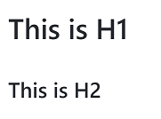
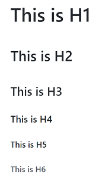

# 2.2 標題

Markdown支援兩種標題(Header)的語法：[Setext][1] 和 [Atx][2] 兩種方式。

[1]:(<https://docutils.sourceforge.io/mirror/setext.html>)
[2]:(<http://www.aaronsw.com/2002/atx/>)


1. Setext 的方式是使用等號(=)及減號(-)來設定 H1 及 H2 這兩個階層的標題。例如：

    ```
    This is H1
    ==========

    This is H2
    ----------
    ```

    顯示的結果為：

    

    
    等號( = )及減號 ( - ) 的數量不影響效果，可以是一個字元，也可以是多個字元。
    

2. Atx 的方式則是在行首加上1個到6個井號(#)來對應H1到H6。例如：

    ```
    # This is H1
    ## This is H2
    ### This is H3
    #### This is H4
    ##### This is H5
    ###### This is H6
    ```

    Markdown 會轉為：

    

    
    你可以選擇性地在行尾加上#號，以便「關閉」atx樣式的標題，這純粹只是美觀用的，若是覺得這樣看起來比較舒適，你就可以在行尾加上#，而行尾的#數量也不用和開頭一樣（行首的井字數量決定標題的階層）。
    
