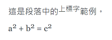
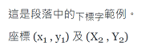
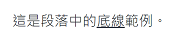

# 2.3 字體效果
## 斜體字

前後加上一個星號( `*` )。

```
這是段落中的*斜體字*範例。
```

顯示的結果為：

這是段落中的_斜體字_範例。

## 粗體字

前後加上兩個星號( `**` )。

```
這是段落中的**粗體字**範例。
```

顯示的結果為：

這是段落中的**粗體字**範例。

## 粗斜體

前後加上三個星號( `***` )。

```
這是段落中的***粗斜體***範例。
```

顯示的結果為：

這是段落中的_**粗斜體**_範例。

## 刪除線

前後加上兩個波浪號( \~ )。

```
這是段落中的~~刪除線~~範例。
```

顯示的結果為：

這是段落中的~~刪除線~~範例。

## 上標字

前後加上一個次方字元( ^ )，或稱為「插入符」，英文為 caret。

```
這是段落中的^上標字^範例。    
a^2^ + b^2^ = c^2^
```

顯示的結果為：




GitHub 及 GitBook 不支援 Markdown的 `[上標字]` 語法。

請使用 KaTeX 的語法：

```
這是段落中的$$^{上標字}$$範例。  
$$a^{2} + b^{2} = c^{2}$$
```

顯示的結果為：

這是段落中的$$^{上標字}$$範例。  
$$a^{2} + b^{2} = c^{2}$$


## 下標字

前後加上一個波浪號( `~` )。

```
這是段落中的~下標字~範例。  
座標 (x~1~ , y~1~) 及 (X~2~ , Y~2~) 
```

顯示的結果為：




GitHub 及 GitBook 不支援 Markdown的 `[下標字]` 語法。

請使用 KaTeX 的語法：

```
這是段落中的$$_{下標字}$$範例。  
座標 $$(x_{1} , y_{1}) 及 (X_{2} , Y_{2})$$
```

顯示的結果為：

這是段落中的$$_{下標字}$$範例。  
座標 $$(x_{1} , y_{1}) 及 (X_{2} , Y_{2})$$


## 底線字

前後加上兩個加號( + )。

```
這是段落中的++底線++範例。
```

顯示的結果為：

這是段落中的++底線++範例。




GitHub 及 GitBook 不支援 Markdown的 `[底線]` 語法。

請使用 KaTeX 的語法：

```
這是段落中的$$\underline{底線}$$範例。
```

顯示的結果為：

這是段落中的$$\underline{底線}$$範例。


## 螢光標記

前後加上兩個等號( = )。

```
這是段落中的==螢光標記==範例。
```

顯示的結果為：



GitHub 及 GitBook 不支援 Markdown的 `[螢光標記]` 語法。


## 字體顏色

Markdown 不支援字體顏色的語法，你可以使用 HTML 的 `<font>` 或 `<mark>` 標籤來加上顏色。

```
這是文字中的<mark style="color:red;">紅色</mark>字體。
```

顯示的結果為：

這是文字中的<mark style="color:red;">紅色</mark>字體。


GitHub 及 GitBook 不支援 `<font color="red">紅色</font>` 的語法。你必須使用 `<mark style="color:red;">紅色</mark>` 的語法。
或是使用 KaTeX 的語法：

```
這是文字中的$$\color{red}{紅色}$$字體。
```

顯示的結果為：

這是文字中的$$\color{red}{紅色}$$字體。

