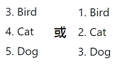
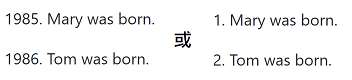

# 2.4 清單

Markdown 語法支援有序清單和無序清單。

## 無序清單

無序清單使用星號( \* )、加號( + ) 或是減號( - ) 作為清單標記：

```
* Red
* Green
* Blue
```

等同於

```
+ Red
+ Green
+ Blue
```

也等同於

```
- Red
- Green
- Blue
```

顯示的結果為：

* Red
* Green
* Blue

等同於

+ Red
+ Green
+ Blue

也等同於

- Red
- Green
- Blue

## 有序清單

有序清單則使用數字接著一個英文句點，例如：

```
1. Bird
2. Cat
3. Dog 
```

顯示的結果為：

1. Bird
2. Cat
3. Dog

很重要的一點是，你在清單標記上使用的數字並不會影響輸出的HTML結果，

上面的清單所產生的 HTML 語法為：

```
<ol>
<li>Bird</li>
<li>Cat</li>
<li>Dog</li>
</ol>
```

如果你的清單標記寫成：

```
1. Bird
1. Cat
1. Dog 
```

或甚至是：

```
1. Bird
3. Cat
8. Dog 
```

你都會得到完全相同的 HTML 輸出。Markdown 語法會忽略數字的內容。

顯示的結果為：

1. Bird
2. Cat
3. Dog

## 有序清單起始數值

對於有序清單寫法，建議第一個項目最好還是從「1.」開始，因為有些 Markdown 的轉譯器會支援有序清單的start屬性。例如以下的清單

```
3. Bird
1. Cat
8. Dog 
```

顯示的結果可能為：



## 清單縮排

清單項目標記通常是放在最左邊，但是其實也可以縮排，最多三個空白，項目標記後面則一定要接著至少一個空白或tab。

要讓清單看起來更漂亮，你可以把內容用固定的縮排整理好：

```
* Lorem ipsum dolor sit amet, consectetuer adipiscing elit. 
  Aliquam hendrerit mi posuere lectus. Vestibulum enim wisi, 
  viverra nec, fringilla in, laoreet vitae, risus.
* Donec sit amet nisl. Aliquam semper ipsum sit amet velit. 
  Suspendisse id sem consectetuer libero luctus adipiscing. 
```

顯示的結果為：

* Lorem ipsum dolor sit amet, consectetuer adipiscing elit. Aliquam hendrerit mi posuere lectus. Vestibulum enim wisi, viverra nec, fringilla in, laoreet vitae, risus.
* Donec sit amet nisl. Aliquam semper ipsum sit amet velit. Suspendisse id sem consectetuer libero luctus adipiscing.

你也可以不縮排：

```
* Lorem ipsum dolor sit amet, consectetuer adipiscing elit. 
Aliquam hendrerit mi posuere lectus. Vestibulum enim wisi, 
viverra nec, fringilla in, laoreet vitae, risus.
* Donec sit amet nisl. Aliquam semper ipsum sit amet velit. 
Suspendisse id sem consectetuer libero luctus adipiscing. 
```

顯示的結果為：

* Lorem ipsum dolor sit amet, consectetuer adipiscing elit. Aliquam hendrerit mi posuere lectus. Vestibulum enim wisi, viverra nec, fringilla in, laoreet vitae, risus.
* Donec sit amet nisl. Aliquam semper ipsum sit amet velit. Suspendisse id sem consectetuer libero luctus adipiscing.

## 清單與空行

如果清單項目間用空行分開， Markdown會把項目的內容在輸出時用 `<p>` 標籤包起來，舉例來說：

```
* Bird
* Magic 
```

會被轉換為如下的 HTML 語法：

```
<ul>
<li>Bird</li>
<li>Magic</li>
</ul>
```

但是這個：

```
* Bird

* Magic 
```

則會被轉換為如下的 HTML 語法：

```
<ul>
<li><p>Bird</p></li>
<li><p>Magic</p></li>
</ul>
```

## 清單中的段落

清單項目可以包含多個段落，每個項目下的段落都必須縮排4個空白或是一個tab：

```
1.  Lorem ipsum dolor sit amet, consectetuer adipiscing elit. Aenean commodo 
    ligula eget dolor. Aenean massa. Cum sociis natoque penatibus et magnis 
    dis parturient montes, nascetur ridiculus mus. 

    Donec quam felis, ultricies nec, pellentesque eu, pretium quis, sem. 
    Nulla consequat massa quis enim.
    
2. Aenean leo ligula, porttitor eu, consequat vitae, eleifend ac, enim. 
   Aliquam lorem ante, dapibus in 
```

顯示的結果為：

1.  Lorem ipsum dolor sit amet, consectetuer adipiscing elit. Aenean commodo ligula eget dolor. Aenean massa. Cum sociis natoque penatibus et magnis dis parturient montes, nascetur ridiculus mus.

    Donec quam felis, ultricies nec, pellentesque eu, pretium quis, sem. Nulla consequat massa quis enim.
2. Aenean leo ligula, porttitor eu, consequat vitae, eleifend ac, enim. Aliquam lorem ante, dapibus in

你也可以不縮排文字：

```
1.  Lorem ipsum dolor sit amet, consectetuer adipiscing elit. Aenean commodo 
ligula eget dolor. Aenean massa. Cum sociis natoque penatibus et magnis 
dis parturient montes, nascetur ridiculus mus. 

    Donec quam felis, ultricies nec, pellentesque eu, pretium quis, sem. 
Nulla consequat massa quis enim.
    
2. Aenean leo ligula, porttitor eu, consequat vitae, eleifend ac, enim. 
Aliquam lorem ante, dapibus inete. 
```

顯示的結果為：

1.  Lorem ipsum dolor sit amet, consectetuer adipiscing elit. Aenean commodo ligula eget dolor. Aenean massa. Cum sociis natoque penatibus et magnis dis parturient montes, nascetur ridiculus mus.

    Donec quam felis, ultricies nec, pellentesque eu, pretium quis, sem. Nulla consequat massa quis enim.
2. Aenean leo ligula, porttitor eu, consequat vitae, eleifend ac, enim. Aliquam lorem ante, dapibus inete.

## 清單中的引言

如果要在清單項目內放進引言，那麼引言的 > 就需要縮排：

```
* Lorem ipsum dolor sit amet, consectetuer adipiscing elit.
    > Donec quam felis, ultricies nec, pellentesque eu, pretium quis, sem. 
Nulla consequat massa quis enim. 
* Aenean leo ligula, porttitor eu, consequat vitae, eleifend ac, enim. 
Aliquam lorem ante, dapibus inete. 
```

顯示的結果為：

*   Lorem ipsum dolor sit amet, consectetuer adipiscing elit.

    > Donec quam felis, ultricies nec, pellentesque eu, pretium quis, sem. Nulla consequat massa quis enim.
* Aenean leo ligula, porttitor eu, consequat vitae, eleifend ac, enim. Aliquam lorem ante, dapibus inete.

## 清單中的程式區塊

如果要放程式碼區塊的話，該區塊就需要縮排兩次，也就是8個空白或是兩個tab：

```
* Lorem ipsum dolor sit amet, consectetuer adipiscing elit.

        function SayHello() {
            console.log('Hello,World.');
        }
        
* Aenean leo ligula, porttitor eu, consequat vitae. 
```

顯示的結果為：

* Lorem ipsum dolor sit amet, consectetuer adipiscing elit.

        function SayHello() {
            console.log('Hello,World.');
        }
        
* Aenean leo ligula, porttitor eu, consequat vitae. 

***

或是縮排一次(4個空白或是1個tab)後，使用反斜線來標註程式碼。

````
* Lorem ipsum dolor sit amet, consectetuer adipiscing elit.
    ```
    function SayHello() {
        console.log('Hello,World.');
    }
    ```      
* Aenean leo ligula, porttitor eu, consequat vitae. 
````

顯示的結果為：

*   Lorem ipsum dolor sit amet, consectetuer adipiscing elit.

    ```
    function SayHello() {
        console.log('Hello,World.');
    }
    ```
* Aenean leo ligula, porttitor eu, consequat vitae.


## 行首出現數字、句點、空白

如果行首不小心出現數字、句點、空白，則可能產生非預期的項目清單。像是下面這樣的寫法：

```
1985. Mary was born.

2000. Tom was born.
```

顯示的結果為：



要避免這樣的狀況，你可以在句點前面加上反斜線

```
1985\. Mary was born.

2000\. Tom was born.
```

顯示的結果為：

1985\. Mary was born.

2000\. Tom was born.
