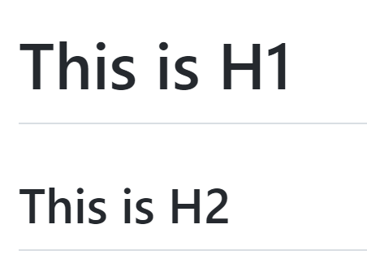
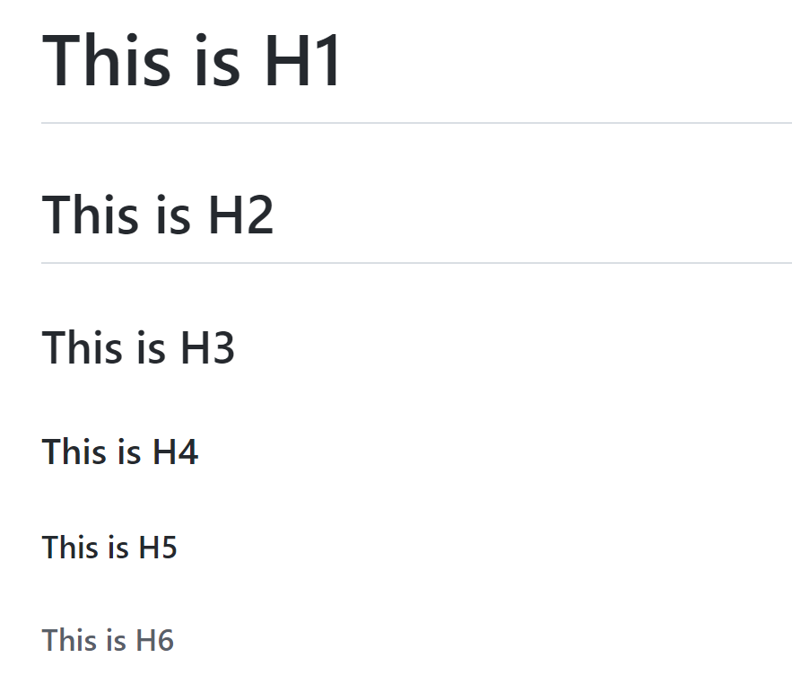

## 1.1 標題

Markdown支援兩種標題的語法：[Setext](https://docutils.sourceforge.io/mirror/setext.html) 和 [Atx](http://www.aaronsw.com/2002/atx/) 兩種方式。

(1). Setext 的方式是使用等號(=)及減號(-)來設定 H1 及 H2 這兩個階層的標題。例如：

```markup
This is H1
==========

This is H2
----------
```

顯示效果：



注意：等號及減號的數量不影響效果，可以是一個字元，也可以是多個字元。

(2). Atx 的方式則是在行首加上1個到6個井號(#)來對應H1到H6。例如：

```markup
# This is H1
## This is H2
### This is H3
#### This is H4
##### This is H5
###### This is H6
```

顯示效果：



注意：你可以選擇性地在行尾加上#號，以便「關閉」atx樣式的標題，這純粹只是美觀用的，若是覺得這樣看起來比較舒適，你就可以在行尾加上#，而行尾的#數量也不用和開頭一樣（行首的井字數量決定標題的階層）。

